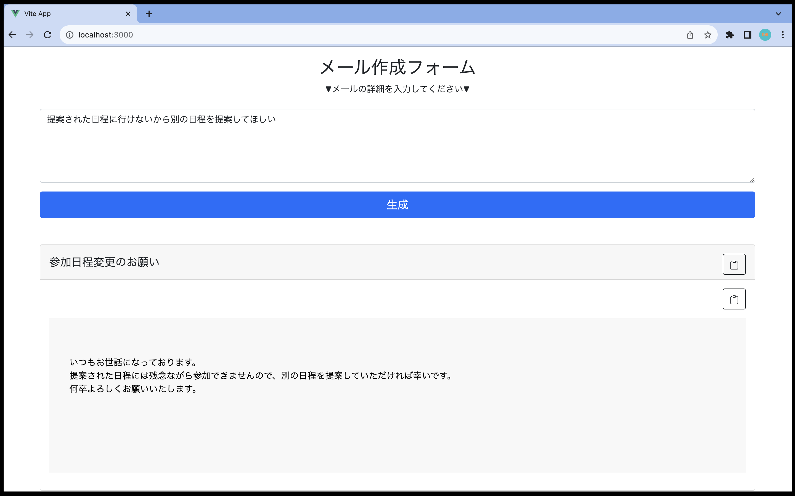

 

# メール作成WEBアプリ

このアプリケーションは、ChatGPTとLangChainを組み合わせて開発されたメール作成WEBアプリです。ユーザーはメールの内容を入力すると、アプリケーションが自動的に件名とメールの内容を綺麗に整形して返します。

 

## 機能

1. **メール内容の入力**: ユーザーはアプリケーションに対してメールの内容を入力します。これには様々なトピックや情報が含まれる可能性があります。

2. **ChatGPTの利用**: 入力されたメール内容はChatGPTを使用して処理されます。ChatGPTは自然言語処理に優れており、文脈を理解し、適切な形で応答を生成します。

3. **LangChainの活用**: ChatGPTの生成したテキストはLangChainを通じて処理され、整形された件名とメールの内容が生成されます。LangChainは言語処理技術を統合したツールで、文の構造を整えたり、適切な表現に修正する役割を果たします。

4. **整形されたメールの出力**: アプリケーションはChatGPTとLangChainを利用して整形されたメールの内容をユーザーに返します。これにより、ユーザーは手軽に綺麗な形でメールを作成することができます。

 

## 使用方法

1. メールの内容を入力します。

2. 「生成」ボタンをクリックします。

3. ChatGPTとLangChainによって整形されたメールが表示されます。

4. ERRORの場合

 

## 技術的な詳細

- **フロントエンド**: HTML, JavaScript, Vue.js

- **バックエンド**: PythonのFlask

- **LangChain**: ChatGPTとLangChainを利用

- **デザイン**: CSSとBootstrap

 

## 開発者

* 大池 樹 (Tatsuki Oike) / プロジェクトマネージャー & デザイン
* 岩井 理紗 (Risa Iwai) / フロントエンド
* 河村真伍 (Shingo Kawamura) / LangChain
* 坪田健士郎 (Kenshiro Tsubota) / LangChain
* 小原和磨 (Kazuma Obara) / バックエンド

 

お楽しみください！
